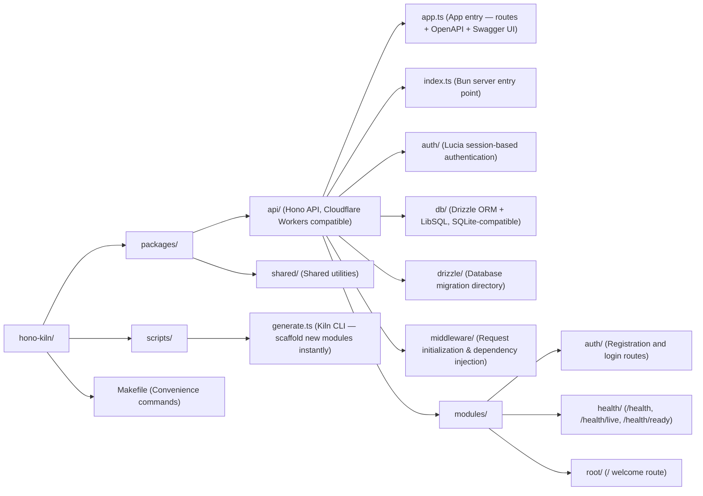
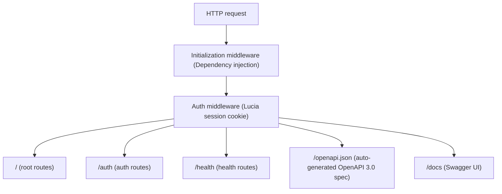

# Hono Kiln 🔥

> **A production-ready Hono API starter with batteries included.**  
> Authentication, database, auto-generated modules, live API docs — all in one opinionated template.

---

## Prerequisites

Before getting started, ensure you have the following installed in your system `PATH` (Unix-like environment recommended):

- **[Bun](https://bun.sh/)** — Primary package manager and script runner.
- **[Docker](https://www.docker.com/)** — For running the local database services.
- **[Git](https://git-scm.com/)** — For version control.

---

## ⚡ Getting Started

### 1. Interactive Bootstrapper

To quickly rebrand and configure this template for your own use, we provide an interactive bootstrapper. After cloning the repository, run:

```sh
bun run setup
```

**The setup script will automate the following:**
- **Rebranding:** Prompts for a new project name and package scope, then executes a project-wide find-and-replace (e.g., replacing `@hono-kiln`). This modifies your project files, so review the changes to avoid accidental data loss.
- **Boilerplate Removal:** Optionally deletes the example `root` module and removes its references to provide a clean slate.
- **Git History Purging:** Optionally deletes the existing `.git` directory and initializes a fresh repository with a new initial commit.
- **Environment Initialization:** Starts Docker services (`docker compose up -d`) and runs database commands to push the schema (`db:push`) and populate initial data (`db:seed`).

### 2. Manual Quick Start

If you prefer to set up manually without the bootstrapper:

```sh
git clone https://github.com/fderuiter/Hono-Kiln.git my-api
cd my-api
bun install
docker compose up -d
make db-push
make db-seed
bun run --filter @hono-kiln/api dev
# → API running at http://localhost:3000
# → Swagger UI at http://localhost:3000/docs
```

That's it. Your API is live, documented, and ready to extend.

---

## Environment Validation

To ensure a reliable local development experience, this project uses a blocking, defensive pre-flight model. Before the server starts in development mode (`NODE_ENV !== 'production'`), it performs mandatory pre-flight checks to validate the environment prerequisites:

1. **Docker Daemon Status:** Verifies that the Docker daemon is active (`docker info`).
2. **Database Container Presence:** Checks that the required database container (e.g., `libsql`) is running (`docker compose ps`).
3. **Database Connectivity:** Ensures the application can establish an active connection to the database.

If any check fails and the environment supports an interactive terminal (TTY), an interactive prompt will guide you to resolve the issue (e.g., by automatically running `docker compose up -d` or updating the database configuration). These prompts feature a 30-second timeout; if there is no response, the server process defaults to a graceful exit. In non-interactive environments, the server process exits immediately with a non-zero code to prevent the application from entering a broken state.

All automated checks can also be executed manually:
- `docker info`
- `docker compose ps --services --filter status=running`
- `make db-push` (to verify schema/connectivity)

---

## Architecture



### Request lifecycle



The request initialization phase leverages middleware to bootstrap core dependencies and inject them into the Hono context (`c.set`). This establishes the dependency injection flow, ensuring services like the database connection and authentication context are immediately available to all subsequent route handlers.

### Active Modules

| Module | Purpose |
|---|---|
| `auth` | Registration and login routes |
| `health` | System health checks (`/health`, `/health/live`, `/health/ready`) |
| `root` | Welcome route (`/`) |

---

## Feature Matrix

| Feature | Stack | Notes |
|---|---|---|
| **HTTP framework** | [Hono](https://hono.dev) | Ultra-fast, edge-compatible |
| **Runtime** | [Bun](https://bun.sh) | Dev & test runner |
| **Deployment target** | Cloudflare Workers | PR preview deployments included |
| **Database** | LibSQL (Turso) | SQLite-compatible, edge-ready |
| **ORM** | [Drizzle ORM](https://orm.drizzle.team) | Type-safe, zero-overhead |
| **Authentication** | [Lucia](https://lucia-auth.com) | Session-based auth out of the box |
| **API documentation** | [@hono/zod-openapi](https://github.com/honojs/middleware/tree/main/packages/zod-openapi) + [@hono/swagger-ui](https://github.com/honojs/middleware/tree/main/packages/swagger-ui) | Live Swagger UI at `/docs` |
| **Schema validation** | [Zod](https://zod.dev) | Request/response types inferred automatically |
| **Module scaffolding** | Kiln CLI | One command generates routes, schema, repository & tests |
| **Testing** | Bun test | Co-located tests per module |
| **Linting** | oxlint | Fast Rust-based linter |
| **Secret scanning** | TruffleHog | Runs on every PR |
| **Releases** | semantic-release | Auto-versioning from Conventional Commits |
| **CI / CD** | GitHub Actions | PR gatekeeper + preview deployments + automated releases |

---

## API Documentation & Authentication

For full API details, including interactive examples of the authentication flow (registration and login), please visit the **interactive Swagger UI** at:
👉 **[http://localhost:3000/docs](http://localhost:3000/docs)**

This live, self-documenting interface provides detailed request/response schemas, error code definitions (e.g., duplicates, invalid credentials), and allows you to test endpoints directly.

Every route is documented automatically. Start the server and visit:

```
http://localhost:3000/docs           # Swagger UI
http://localhost:3000/openapi.json   # Raw OpenAPI 3.0 spec
```

Routes are defined with `@hono/zod-openapi`, giving you:

- **Compile-time type safety** — request and response shapes are inferred from Zod schemas.
- **Zero-config docs** — the spec is generated at runtime; no separate YAML/JSON to maintain.
- **Auto-validation** — invalid requests return structured 422 errors.

---

## Kiln CLI

Scaffold a complete new module in one command:

```sh
bun kiln generate module <name>
```

### Configuration

- `AUDIBLE_BELL`: Set to `'false'` to silence the auditory alert (ASCII bell character) triggered when input matches generic placeholders during interactive module generation. Defaults to enabled.

This creates `packages/api/modules/<name>/` with four files:

| File | Purpose |
|---|---|
| `schema.ts` | Zod-ready entity constants |
| `repository.ts` | Data access function |
| `routes.ts` | Hono route handlers |
| `routes.test.ts` | Co-located Bun tests |

The module is also automatically mounted in `app.ts` at `/<name>`.

### Example

```sh
bun kiln generate module products
```

Generates `packages/api/modules/products/` and mounts it at `/products`.

---

## Database

The `packages/api/drizzle/` directory manages database migrations, tracking schema evolution and storing the SQL migration files generated from the Drizzle schema.

Start a local LibSQL server:

```sh
docker compose up -d
```

Generate a migration from the Drizzle schema:

```sh
make db-migrate
```

Push the schema directly to the local LibSQL server:

```sh
make db-push
```

Populate the database with initial development data (seeding):

```sh
make db-seed
```
(Alternatively, you can run these database commands via Bun within the API workspace: `cd packages/api && bun run db:seed`).

The API defaults to `http://127.0.0.1:8080` when `DATABASE_URL` is not set.

---

## Testing

```sh
bun install          # install deps
bun test             # run all tests across all packages
bun test packages/api  # run API tests only
```

---

## Maintenance & Code Audit

To maintain a clean codebase, this project uses [Knip](https://knip.dev/) to detect unused files, dependencies, and unreferenced exports across the monorepo workspace.

Run the code audit tool from the root directory:

```sh
bun run knip
```

This command will scan the workspace based on the `knip.json` configuration and report any unreferenced code, helping you identify what can be safely removed or refactored.

---

## CI / CD

### PR Gatekeeper

On every pull request targeting `main`, the **PR Gatekeeper** workflow runs:

- **Tests** – `bun test` across all packages
- **Lint** – `oxlint` on the full source tree
- **Secret scan** – TruffleHog scans the commits changed by the PR

No secrets are required for this workflow.

### PR Preview Deployments

On every pull request, the **PR Preview Deployment** workflow deploys a
temporary Cloudflare Worker named `hono-kiln-pr-<number>` and posts the
preview URL as a PR comment. The worker is deleted when the PR is closed.

> **Note:** When the required secrets are not configured the deployment jobs
> are automatically skipped, so the workflow will pass without deploying
> anything. This is the expected behaviour for forks and template instances.

Required repository secrets:

| Secret | Description |
|---|---|
| `CLOUDFLARE_API_TOKEN` | Cloudflare API token with *Workers Scripts: Edit* permission |
| `CLOUDFLARE_ACCOUNT_ID` | Your Cloudflare account ID |

### Automated Releases

When a commit is pushed (or merged) to `main`, the **Release** workflow runs
[semantic-release](https://semantic-release.gitbook.io) to:

1. Determine the next version from [Conventional Commits](https://www.conventionalcommits.org)
2. Bump the version in `package.json`
3. Generate / update `CHANGELOG.md`
4. Create a GitHub Release with auto-generated release notes

Required repository secret:

| Secret | Description |
|---|---|
| `GITHUB_TOKEN` | Automatically provided by GitHub Actions – no manual setup needed |

